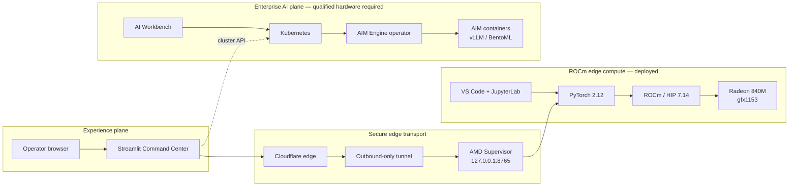

# Architecture

## Planes

### Presentation plane

Streamlit Community Cloud hosts the public command center. It displays laptop ROCm telemetry and, later, Enterprise AI cluster state.

### Edge compute plane

The Dell laptop runs PyTorch through ROCm/HIP on the Radeon 840M. A future localhost-only API will expose read-only status plus explicitly authorized benchmark and inference operations.

### Secure connectivity plane

Cloudflare Tunnel creates an outbound-only connection from the laptop. Cloudflare Access authenticates the cloud application. The laptop API independently verifies a bearer token.

### Enterprise compute plane

A future supported AMD server cluster will host Kubernetes, AMD GPU Operator, AIM Engine, KServe, AIMs, AI Workbench, and Resource Manager. The Ryzen laptop does not pretend to provide this plane.

## Trust boundaries

1. No inbound router port forwarding.
2. The edge API listens only on localhost.
3. Cloudflare service credentials remain in Streamlit Secrets.
4. Application bearer tokens are independently revocable.
5. Mutating operations are separated from read-only telemetry.
6. No secret values are logged or committed.

## Compute architecture

Solid paths are deployed or verified on the laptop. Dashed paths represent integration with a separate supported AMD Enterprise AI cluster.

## Capability boundary

The Radeon 840M is a valid ROCm edge accelerator for this project. Current published AIM profiles target AMD Instinct MI300X, MI325X, MI350X, MI355X and Radeon Pro W7900/R9700. The laptop can host a Kubernetes/AIM Engine control-plane lab, but AIM model pods must not be reported as production-ready on the 840M unless AMD publishes a matching profile.

The future Enterprise AI cluster is a separate backend with its own identity, API keys, quotas, and observability.
